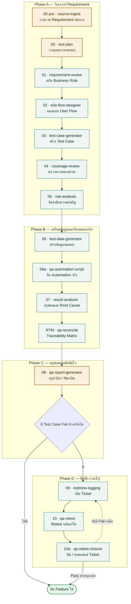

# QA Pipeline — Process Flow

เอกสารนี้อธิบายลำดับการทำงานของ QA Pipeline ทั้ง 15 Skill ตั้งแต่การรวบรวม Requirement จนถึงการปิด Ticket ใน Redmine หลังแก้ไขบั๊ก ใช้เป็นเอกสารอ้างอิงสำหรับทีมที่ต้องการเข้าใจภาพรวมของกระบวนการหรือเริ่มใช้งาน Pipeline นี้กับฟีเจอร์ใหม่

ทุก Skill ที่ระบุในเอกสารนี้ผ่านการทดสอบจริงกับสถานการณ์จำลอง "Discount Code Application" มาแล้วอย่างน้อย 1 รอบเต็ม (รวมถึงการเชื่อมต่อ Redmine จริงในขั้นตอนเปิด/ปิด Ticket)

**สรุปสั้นๆ**

- Pipeline มี 15 Stage แบ่งเป็น 4 Phase เรียงต่อกันเป็นเส้นตรง ยกเว้น Phase สุดท้ายที่วนซ้ำได้
- เกือบทุก Stage ทำงานอัตโนมัติได้เต็มรูปแบบ มีเพียง 3 จุดที่ต้องรอการอนุมัติ/ลงนามจากคนจริงเสมอ
- Stage 09–10a เชื่อมต่อ Redmine จริง และต้องขอ URL/API Key ใหม่ทุกครั้งที่รัน (ดูหัวข้อความปลอดภัยด้านล่าง)

## โครงสร้าง Repository

Repository นี้เผยแพร่เฉพาะส่วน `skills/` (ตัว Pipeline framework) ก่อนในตอนนี้:

```
.
└── skills/                              # นิยาม Skill ทั้ง 15 ตัว เรียงตามลำดับ Flow จริง
    ├── 00-pre-source-ingest/
    ├── 00-test-plan/
    ├── 01-requirement-review/
    ├── 02-e2e-flow-designer/
    ├── 03-test-case-generator/
    ├── 04-coverage-review/
    ├── 05-risk-analysis/
    ├── 06-test-data-generator/
    ├── 06a-qa-automation-script/
    ├── 07-result-analysis/
    ├── 07a-RTM-qa-reconcile/
    ├── 08-qa-report-generator/
    ├── 09-redmine-logging/
    ├── 10-qa-retest/
    ├── 10a-qa-retest-closure/
    └── _shared/                         # โมดูลที่ใช้ร่วมกันหลาย Skill (ไม่ใช่ Stage ในสาย Flow)
```

ตัวอย่างการรันจริงครบทุก Stage (case study เช่น "Discount Code Application" ที่ผ่าน Redmine จริง) จะถูกเพิ่มเข้ามาเป็นโฟลเดอร์แยกในภายหลัง เมื่อผลการรันชุดล่าสุดพร้อม

---

## สารบัญ

- [โครงสร้าง Repository](#โครงสร้าง-repository)
- [ภาพรวม](#ภาพรวม)
- [แผนภาพกระบวนการ](#แผนภาพกระบวนการ)
- [ตารางอ้างอิงแต่ละ Stage](#ตารางอ้างอิงแต่ละ-stage)
- [วงรอบการปิดบั๊ก (Stage 09–10a)](#วงรอบการปิดบั๊ก-stage-0910a)
- [การจัดการข้อมูลรับรองความปลอดภัย](#การจัดการข้อมูลรับรองความปลอดภัย)
- [เงื่อนไขการปิด Feature](#เงื่อนไขการปิด-feature)

---

## ภาพรวม

Pipeline แบ่งออกเป็น 4 ช่วง (Phase):

| Phase | ขอบเขต | Stage ที่เกี่ยวข้อง |
|---|---|---|
| A — วิเคราะห์ Requirement | รวบรวมข้อมูลต้นทาง วางแผนทดสอบ ออกแบบ Test Case | 00-pre, 00, 01, 02, 03, 04, 05 |
| B — เตรียมข้อมูลและรันทดสอบจริง | สร้างข้อมูลทดสอบ รัน Automation จริง สรุปผล ตรวจ Traceability | 06, 06a, 07, RTM |
| C — สรุปผลและตัดสินใจ | รวมผลทั้งหมดเป็นรายงาน Go / No-Go | 08 |
| D — ปิดบั๊ก | เปิด Ticket, Retest, ปิด Ticket — วนซ้ำจนไม่มี Fail เหลือ | 09, 10, 10a |

Stage ส่วนใหญ่ทำงานอัตโนมัติได้ทั้งหมด มีเพียง 3 จุดที่ต้องได้รับการอนุมัติจากบุคคลจริงเสมอ ได้แก่ Stage 00-pre, Stage 00 และช่องลงนามใน `08-qa-report.docx` — ระบบไม่อนุญาตให้อัตโนมัติเติมข้อมูลในจุดเหล่านี้แทนคน

---

## แผนภาพกระบวนการ



**คำอธิบายสัญลักษณ์**: กล่องสีเขียวอ่อน = Skill ทำงานอัตโนมัติทั้งหมด · กล่องสีน้ำตาลอ่อน = ต้องได้รับการอนุมัติ/ลงนามจากบุคคลจริงก่อนถือว่าเสร็จ

---

## ตารางอ้างอิงแต่ละ Stage

| Stage | Skill | หน้าที่ | ข้อมูลนำเข้า | ผลลัพธ์ | ประเภท |
|---|---|---|---|---|---|
| 00-pre | `00-pre-source-ingest` | รวบรวมแหล่งข้อมูลต้นทาง (สเปก, chat log, บันทึกประชุม) สรุปเป็นชุดเดียว พร้อมชี้จุดขัดแย้ง/ช่องว่าง | ไฟล์ต้นฉบับดิบจากผู้ใช้ | `00-pre-source-ingest.md` | ต้องอนุมัติ |
| 00 | `00-test-plan` | วางแผนทดสอบ: ขอบเขต, Exit Criteria, Environment, ตารางเวลา, ความเสี่ยง | ผลจาก 00-pre, กำหนดการจริง | `testplans/TP-*.md` | ต้องอนุมัติ |
| 01 | `01-requirement-review` | สกัด Business Rule และ Open Question จาก Requirement ต้นทาง | 00-pre, 00 | `01-requirement-review.md` | อัตโนมัติ |
| 02 | `02-e2e-flow-designer` | ออกแบบ User Flow ทั้งหมดจาก Business Rule | 01 | `02-e2e-flow.md` | อัตโนมัติ |
| 03 | `03-test-case-generator` | สร้าง Test Case ครอบคลุมทุก Business Rule และ Flow | 01, 02, ค่า Environment/Config จริง | `03-test-case-workbook.xlsx` | อัตโนมัติ |
| 04 | `04-coverage-review` | ตรวจสอบความครบถ้วนของ Test Case เทียบกับ Requirement | Workbook (03) เทียบ 01+02 | `04-coverage-review.md` | อัตโนมัติ |
| 05 | `05-risk-analysis` | กำหนด Priority (P0–P3) ให้ทุก Test Case | Workbook (03) | `05-risk-analysis.md` | อัตโนมัติ |
| 06 | `06-test-data-generator` | แปลง Test Data ให้เป็นข้อมูลที่ใช้ทดสอบได้จริง | Workbook (03) | `06-test-data.md` | อัตโนมัติ |
| 06a | `06a-qa-automation-script` | เขียนและรัน Automation จริงต่อ Environment จริง บันทึกผลและภาพหลักฐาน | Workbook (03), 06, Environment ที่ใช้งานได้จริง | `automation/*`, `screenshots/*`, ผลใน Workbook | อัตโนมัติ |
| 07 | `07-result-analysis` | สรุปผลรวมและวิเคราะห์ Root Cause ของ Fail/Blocked | Workbook หลัง 06a | `07-result-analysis.docx`, `07-photo-evidence.docx` | อัตโนมัติ |
| RTM | `07a-RTM-qa-reconcile` | คำนวณ Requirement Traceability Matrix ใหม่จากข้อมูลจริงเสมอ | 01, 02, Workbook (03) | `RTM-traceability-matrix.xlsx` | อัตโนมัติ |
| 08 | `08-qa-report-generator` | รวมผลทั้งหมดเป็นรายงานสรุป Go / Conditional Go / No-Go | 07, RTM, Workbook, Deadline | `08-qa-report.docx` | ต้องลงนาม |
| 09 | `09-redmine-logging` | เปิด Ticket ใน Redmine ให้ทุกเคสที่ Fail พร้อมแนบหลักฐานและแจ้ง Dev | Workbook (เคส Fail), อีเมล Dev | Ticket ใน Redmine, `09-redmine-log.md` | อัตโนมัติ* |
| 10 | `10-qa-retest` | รัน Automation ซ้ำหลัง Dev แก้ไข เทียบผลใหม่ | Workbook (เคสที่มี Issue link) | `10-retest-run-result.json`, ผลใน Workbook | อัตโนมัติ* |
| 10a | `10a-qa-retest-closure` | ปิด Ticket (กรณี Pass) หรือคอมเมนต์แจ้งผล (กรณี Fail) กลับ Redmine | ผล Retest จาก 10 | `10a-closure-result.json`, สถานะ Ticket อัปเดต | อัตโนมัติ* |

\* Stage 09, 10 และ 10a ทำงานอัตโนมัติได้ทั้งหมด แต่ต้องรับข้อมูลรับรอง (Redmine URL / API Key) ใหม่จากผู้ใช้ทุกครั้งที่รัน ดู [การจัดการข้อมูลรับรองความปลอดภัย](#การจัดการข้อมูลรับรองความปลอดภัย)

---

## วงรอบการปิดบั๊ก (Stage 09–10a)

Stage 09, 10 และ 10a ไม่ได้ทำงานเชิงเส้นแบบ Phase อื่น แต่เป็นวงรอบที่ทำซ้ำได้จนกว่าจะไม่มี Test Case สถานะ Fail เหลืออยู่:

1. **09 — redmine-logging**: เปิด Ticket ให้ทุกเคสที่ Fail พร้อมแนบภาพหลักฐาน แจ้ง Dev ทางอีเมล
2. **10 — qa-retest**: หลัง Dev แจ้งว่าแก้ไขแล้ว รัน Automation ซ้ำเฉพาะเคสที่มี Ticket ค้างอยู่
3. **10a — qa-retest-closure**: นำผล Retest ไปจัดการ Ticket จริง — ปิด Ticket ถ้า Pass, คอมเมนต์ผลถ้ายัง Fail
4. หากยังมี Fail เหลืออยู่หลังขั้นตอนที่ 3 ให้กลับไปเริ่มที่ขั้นตอนที่ 1 ใหม่สำหรับเคสที่ยังไม่ผ่าน
5. เมื่อ Pass ครบทุกเคสและปิด Ticket หมดแล้ว ถือว่า Pipeline เสร็จสมบูรณ์

---

## การจัดการข้อมูลรับรองความปลอดภัย

Stage 09, 10 และ 10a เชื่อมต่อกับ Redmine จริง จึงมีข้อกำหนดด้านความปลอดภัยที่ใช้ตลอดทั้งสาย:

- Redmine URL และ API Key ต้องถูกขอใหม่จากผู้ใช้ทุกครั้งที่เรียก Skill เหล่านี้ ห้ามบันทึกหรือแคชไว้ในไฟล์ใดๆ ทั้งสิ้น
- ค่าเหล่านี้ต้องถูกตั้งผ่าน Environment Variable เท่านั้น ห้ามส่งผ่าน command-line argument โดยตรง
- ข้อกำหนดเดียวกันนี้ใช้กับ SMTP credentials ที่ใช้ส่งอีเมลแจ้ง Dev
- อีเมลของ Dev ไม่ถือเป็นข้อมูลลับ สามารถใช้ซ้ำได้ตามปกติ

---

## เงื่อนไขการปิด Feature

Feature หนึ่งจะถือว่าปิดสมบูรณ์ได้ก็ต่อเมื่อครบทุกข้อต่อไปนี้:

1. Stage 01 ถึง 10a ทั้งหมดมีสถานะ Complete ใน `_pipeline-manifest.md`
2. ไม่มี Test Case สถานะ Fail ค้างอยู่ใน Workbook
3. Stage 00-pre และ Stage 00 ได้รับการอนุมัติจริงจากผู้ใช้ (กรอกส่วน "QA Review & Sign-off" ในไฟล์ผลลัพธ์ด้วยตนเอง)
4. ช่องลงนามของ QA Lead และ PM/Product Owner ใน `08-qa-report.docx` ได้รับการลงนามจริง

ข้อ 3 และ 4 เป็นขั้นตอนที่ระบบออกแบบให้ต้องผ่านการกระทำของบุคคลจริงเสมอ ไม่มีกลไกใดให้ระบบอัตโนมัติดำเนินการแทนได้
