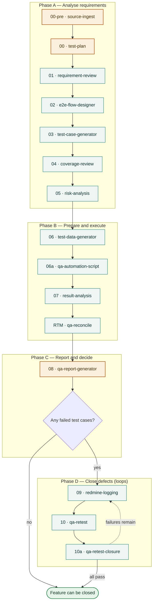

# QA Pipeline — From Requirements to Closed Bugs

**English** | [ภาษาไทย](README.th.md)


A set of **15 AI-agent skills** that take one feature through the whole QA lifecycle — collecting requirements, writing the test plan and test cases, running Playwright automation, reporting Go / No-Go, opening Redmine tickets for failures, retesting after the fix, and closing the tickets.

> **Note:** the skill definitions (`skills/*/SKILL.md`) are written in **Thai**. They are written to work with both Claude and Gemini and avoid platform-specific tool names. This README explains the structure in English.

---

## What this project demonstrates

- **A repeatable QA process, not one-off prompts:** 15 stages in 4 phases, each with defined inputs, outputs and gates.
- **Human sign-off where it matters:** only 3 points need a person (source approval, test-plan approval, and the signature on the QA report). The system is designed so automation cannot fill these in on a person's behalf.
- **Traceability:** the RTM (Requirement Traceability Matrix) is recomputed from source files every time, never trusted from a previous run.
- **Real tools, real evidence:** the worked example runs real Playwright tests, opens and closes a real Redmine ticket, and sends a real notification email, with screenshots at every external step.
- **Credential safety:** Redmine URL / API key and SMTP credentials are requested per run, passed by environment variable only, and never written to files.

## Worked example

[`examples/newsletter-email-subscription/`](examples/newsletter-email-subscription/) runs all 15 stages on one small feature (newsletter sign-up in a site footer).

| | |
| :--- | :--- |
| Test cases | 11 (TC-001 – TC-011) |
| Automation result | 10 passed, 1 failed (TC-005, found by the automation) |
| Defect lifecycle | Redmine ticket opened → developer fix → retest passed → ticket closed |
| QA report verdict | Conditional Go (no P0 failures, one P1 failure) before the fix |
| Browsers | Chromium only (see limitations below) |

**Limitations, stated plainly**

- The feature under test is **simulated**: a small Flask demo app (`automation/demo-app/server.py`) was written to follow the business rules, with one bug planted on purpose (BR-002). The pass/fail results come from real test runs against it, but it is not a production system.
- Cross-browser testing (TC-009) was planned for 4 browsers but the run environment only had Chromium. Stages 06a and 07 are therefore reported as **Complete (Partial)** rather than hidden.
- The Redmine instance is a hosted (Planio) workspace used only for this example.

---

## The 15 stages

| Phase | Purpose | Stages |
| :--- | :--- | :--- |
| **A — Analyse requirements** | Collect sources, plan, design test cases | 00-pre, 00, 01 – 05 |
| **B — Prepare & execute** | Test data, automation, results, traceability | 06, 06a, 07, RTM |
| **C — Report & decide** | Go / Conditional Go / No-Go report | 08 |
| **D — Close defects (loops)** | Open ticket → retest → close, until no failures remain | 09, 10, 10a |

| Stage | Skill | What it does | Output | Type |
| :--- | :--- | :--- | :--- | :--- |
| 00-pre | `00-pre-source-ingest` | Gather requirements from many sources into one source set; flag gaps and conflicts | `00-pre-source-ingest.md` | Needs approval |
| 00 | `00-test-plan` | Scope, exit criteria, environment, schedule, risks | `testplans/TP-*.md` | Needs approval |
| 01 | `01-requirement-review` | Extract business rules and open questions | `01-requirement-review.md` | Automatic |
| 02 | `02-e2e-flow-designer` | Design end-to-end user flows | `02-e2e-flow.md` | Automatic |
| 03 | `03-test-case-generator` | Generate test cases covering every rule and flow | `03-test-case-workbook.xlsx` | Automatic |
| 04 | `04-coverage-review` | Check the test cases against requirements for gaps | `04-coverage-review.md` | Automatic |
| 05 | `05-risk-analysis` | Assign priority P0 – P3 to each test case | `05-risk-analysis.md` | Automatic |
| 06 | `06-test-data-generator` | Turn test-data descriptions into concrete mock data | `06-test-data.md` | Automatic |
| 06a | `06a-qa-automation-script` | Write and run Playwright scripts, capture evidence | `automation/*`, `screenshots/*` | Automatic |
| 07 | `07-result-analysis` | Summarise results and root causes | `07-result-analysis.docx` | Automatic |
| RTM | `07a-RTM-qa-reconcile` | Recompute the traceability matrix from scratch | `RTM-traceability-matrix.xlsx` | Automatic |
| 08 | `08-qa-report-generator` | Final Go / Conditional Go / No-Go report | `08-qa-report.docx` | Needs signature |
| 09 | `09-redmine-logging` | Open a Redmine ticket for each failure with evidence | Redmine tickets | Automatic* |
| 10 | `10-qa-retest` | Re-run failed cases after the developer's fix | `10-retest-run-result.json` | Automatic* |
| 10a | `10a-qa-retest-closure` | Close (pass) or comment on (fail) the ticket | Ticket updated | Automatic* |

\* Stages 09, 10 and 10a need a Redmine URL and API key from the user on every run.

### Flow


```mermaid
flowchart TD
    subgraph A["Phase A — Analyse requirements"]
        direction TB
        A1["00-pre · source-ingest"]:::gate
        A2["00 · test-plan"]:::gate
        A3["01 · requirement-review"]:::auto
        A4["02 · e2e-flow-designer"]:::auto
        A5["03 · test-case-generator"]:::auto
        A6["04 · coverage-review"]:::auto
        A7["05 · risk-analysis"]:::auto
        A1 --> A2 --> A3 --> A4 --> A5 --> A6 --> A7
    end
    subgraph B["Phase B — Prepare and execute"]
        direction TB
        B1["06 · test-data-generator"]:::auto
        B2["06a · qa-automation-script"]:::auto
        B3["07 · result-analysis"]:::auto
        B4["RTM · qa-reconcile"]:::auto
        B1 --> B2 --> B3 --> B4
    end
    subgraph C["Phase C — Report and decide"]
        direction TB
        C1["08 · qa-report-generator"]:::gate
        C2{"Any failed test cases?"}
        C1 --> C2
    end
    subgraph D["Phase D — Close defects (loops)"]
        direction TB
        D1["09 · redmine-logging"]:::auto
        D2["10 · qa-retest"]:::auto
        D3["10a · qa-retest-closure"]:::auto
        D1 --> D2 --> D3
        D3 -. "failures remain" .-> D1
    end
    A7 --> B1
    B4 --> C1
    C2 -- "no" --> DONE(["Feature can be closed"])
    C2 -- "yes" --> D1
    D3 -- "all pass" --> DONE
    classDef auto fill:#eef5f3,stroke:#0f766e,color:#0b3630,stroke-width:1px;
    classDef gate fill:#faf0dd,stroke:#b45309,color:#4a2e04,stroke-width:1.5px;
    classDef terminal fill:#e7f4ea,stroke:#15803d,color:#0d3a1f,stroke-width:1.5px;
    class DONE terminal;
```

Green = fully automatic. Amber = needs a person's approval or signature. A standalone HTML version is in [`docs/qa-pipeline-flow.html`](docs/qa-pipeline-flow.html).

---

## Repository structure

```
.
├── skills/                    # the 15 skill definitions, in flow order
│   ├── 00-pre-source-ingest/ … 10a-qa-retest-closure/
│   └── _shared/               # shared Python modules (workbook I/O, Playwright runner, Redmine & email helpers)
├── examples/
│   └── newsletter-email-subscription/   # full 15-stage worked example
├── docs/
│   └── qa-pipeline-flow.html  # standalone flow diagram
└── test-reports/              # test reports for the skills themselves
```

## Closing a feature

A feature is considered closed only when **all** of these hold:

1. Stages 01 – 10a are marked Complete in `_pipeline-manifest.md`.
2. No test case is left in Fail status in the workbook.
3. Stages 00-pre and 00 were approved by a person (the "QA Review & Sign-off" section filled in by hand).
4. The QA Lead and PM / Product Owner signature fields in `08-qa-report.docx` are signed.

Items 3 and 4 always require a real person; nothing in the pipeline can do them automatically.

## Security of credentials

- The Redmine URL and API key must be requested from the user **every time** stages 09 – 10a run, and are never saved or cached in any file.
- They are provided through environment variables only, never as command-line arguments.
- The same rule applies to the SMTP credentials used to email the developer.

## License

Released under the [MIT License](LICENSE).

## Author

**Jirapat Jiramonthon** — [GitHub @Jiramonthon-j](https://github.com/Jiramonthon-j) · [LinkedIn](https://www.linkedin.com/in/jirapat-jiramonthon-930240395)
