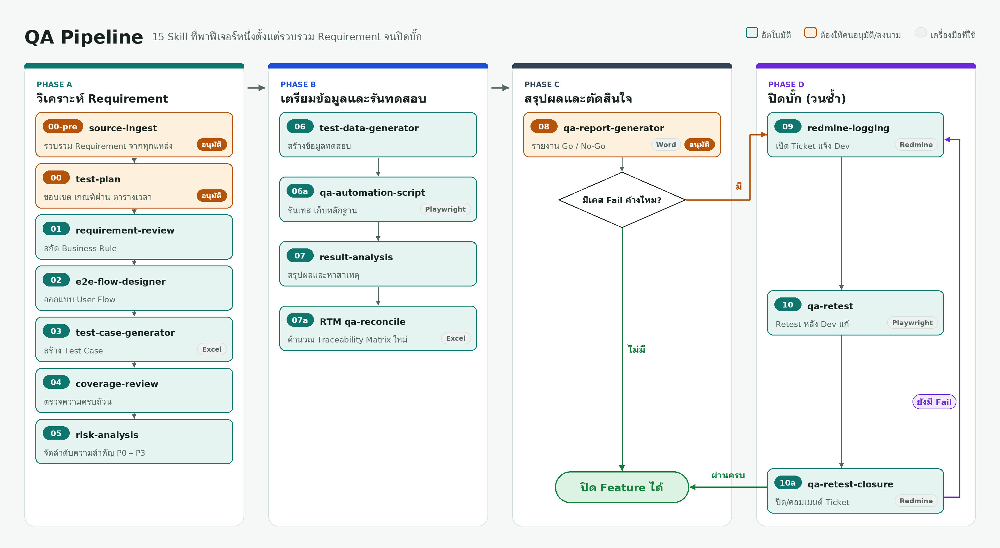

# QA Pipeline — Process Flow

[English](README.md) | **ภาษาไทย**


15 Skill ที่ทำงานต่อเนื่องกัน ตั้งแต่รวบรวม Requirement จนถึงปิด Ticket ใน Redmine หลังแก้บั๊ก ใช้เป็น Framework อ้างอิงเมื่อเริ่มทดสอบฟีเจอร์ใหม่ ทุก Skill ผ่านการรันจริงครบทั้งสายกับฟีเจอร์ตัวอย่าง "Newsletter Email Subscription" มาแล้วอย่างน้อย 1 รอบเต็ม (รวม Redmine จริง — ดู [`examples/newsletter-email-subscription/`](./examples/newsletter-email-subscription/))

**สรุป**: 15 Stage / 4 Phase เรียงเส้นตรง ยกเว้น Phase สุดท้ายวนซ้ำได้ · เกือบทั้งหมดอัตโนมัติ มีเพียง 3 จุดที่ต้องรอคนอนุมัติ (Stage 00-pre, 00, และลายเซ็นใน `08-qa-report.docx`) · Stage 09–10a ต่อ Redmine จริง ต้องขอ URL/API Key ใหม่ทุกครั้ง (ดู [ความปลอดภัย](#ความปลอดภัยของข้อมูลรับรอง))

---

<p align="center">
  <a href="docs/images/qa-pipeline-flow-th.png"></a>
</p>

## โปรเจกต์นี้แสดงให้เห็นอะไร

- **กระบวนการ QA ที่ทำซ้ำได้ ไม่ใช่ prompt เป็นครั้ง ๆ:** 15 stage ใน 4 phase แต่ละ stage กำหนดข้อมูลนำเข้า ผลลัพธ์ และจุดตรวจไว้ชัดเจน
- **ให้คนอนุมัติในจุดที่สำคัญ:** มีเพียง 3 จุดที่ต้องใช้คน (อนุมัติแหล่งข้อมูล, อนุมัติแผนทดสอบ, ลงนามในรายงาน QA) และระบบออกแบบไว้ไม่ให้ระบบอัตโนมัติกรอกแทนคนได้
- **Traceability:** Requirement Traceability Matrix (RTM) คำนวณใหม่จากไฟล์ต้นทางทุกครั้ง ไม่เชื่อผลจากรอบก่อน
- **ใช้เครื่องมือจริง มีหลักฐานจริง:** ตัวอย่างรัน Playwright จริง เปิดและปิด Ticket ใน Redmine จริง ส่งอีเมลแจ้งเตือนจริง พร้อมภาพหน้าจอในทุกจุดที่แตะระบบภายนอก
- **ความปลอดภัยของ credential:** Redmine URL / API key และ SMTP credential ถูกขอใหม่ทุกครั้งที่รัน ส่งผ่าน environment variable เท่านั้น และไม่เขียนลงไฟล์

## ตัวอย่างที่รันจริง

[`examples/newsletter-email-subscription/`](examples/newsletter-email-subscription/) รันครบทั้ง 15 stage กับฟีเจอร์เล็ก ๆ 1 ฟีเจอร์ (สมัครรับข่าวสารที่ Footer ของเว็บ)

| | |
| :--- | :--- |
| Test case | 11 เคส (TC-001 – TC-011) |
| ผล Automation | ผ่าน 10 ไม่ผ่าน 1 (TC-005 ซึ่ง automation ตรวจพบเอง) |
| วงจรบั๊ก | เปิด Ticket ใน Redmine → Dev แก้ → Retest ผ่าน → ปิด Ticket |
| ผลรายงาน QA | Conditional Go (ไม่มี P0 Fail แต่มี P1 Fail 1 เคส) ก่อนแก้ |
| Browser | Chromium เท่านั้น (ดูข้อจำกัดด้านล่าง) |

**ข้อจำกัด ที่ระบุไว้ตรง ๆ**

- ฟีเจอร์ที่ใช้ทดสอบเป็น **ของจำลอง:** สร้างเว็บเดโม Flask (`automation/demo-app/server.py`) ตาม Business Rule โดยฝังบั๊กไว้ 1 จุดตั้งใจ (BR-002) ผล Pass/Fail มาจากการรันทดสอบจริงกับเว็บนี้ แต่ไม่ใช่ระบบ production
- การทดสอบข้าม Browser (TC-009) วางแผนไว้ 4 Browser แต่เครื่องที่ใช้รันมีแค่ Chromium จึงรายงาน Stage 06a และ 07 ว่า **Complete (Partial)** ไม่ปิดบังข้อจำกัดนี้
- Redmine ที่ใช้เป็น workspace บน Planio ที่สร้างไว้ใช้กับตัวอย่างนี้เท่านั้น

> หมายเหตุ: ไฟล์นิยาม Skill (`skills/*/SKILL.md`) เขียนเป็นภาษาไทย และเขียนให้ใช้ได้ทั้งกับ Claude และ Gemini โดยไม่อ้างชื่อ tool เฉพาะของแพลตฟอร์ม

---

## โครงสร้าง Repository

```
.
├── skills/                    # ตัว Pipeline framework — นิยาม 15 Skill
│   ├── 00-pre-source-ingest/
│   ├── 00-test-plan/
│   ├── 01-requirement-review/
│   ├── 02-e2e-flow-designer/
│   ├── 03-test-case-generator/
│   ├── 04-coverage-review/
│   ├── 05-risk-analysis/
│   ├── 06-test-data-generator/
│   ├── 06a-qa-automation-script/
│   ├── 07-result-analysis/
│   ├── 07a-RTM-qa-reconcile/
│   ├── 08-qa-report-generator/
│   ├── 09-redmine-logging/
│   ├── 10-qa-retest/
│   ├── 10a-qa-retest-closure/
│   └── _shared/                # โมดูลใช้ร่วมกันหลาย Skill (ไม่ใช่ Stage ในสาย Flow)
├── examples/
│   └── newsletter-email-subscription/   # ตัวอย่างรันจริงครบทั้ง 15 Skill กับฟีเจอร์เล็กๆ 1 ฟีเจอร์
│                                         # (รวม Redmine Ticket จริง, Playwright Automation จริง — ดู README ในนั้น)
├── docs/
│   └── qa-pipeline-flow.html  # แผนภาพกระบวนการแบบ standalone (ไฟล์เดียวกับ Mermaid ด้านล่าง เปิดดูได้โดยไม่ต้องพึ่ง GitHub renderer)
└── test-reports/               # รายงานผลการทดสอบ Skill ระหว่างพัฒนา (ไม่ใช่ส่วนหนึ่งของ Pipeline)
```

โฟลเดอร์ `skills/` ตั้งชื่อตามลำดับ Flow จริง (00 → 10a) — อยากเห็นตัวอย่างการรันจริงแบบจับต้องได้ (ไฟล์
เอกสาร, Test Case Workbook ทุก Version, สกรีนช็อตหลักฐานทุก Skill ที่แตะระบบภายนอก) ไปที่
[`examples/newsletter-email-subscription/`](./examples/newsletter-email-subscription/) ได้เลย

---

## ภาพรวม 4 Phase

| Phase | ขอบเขต | Stage |
|---|---|---|
| A — วิเคราะห์ Requirement | รวบรวมข้อมูล วางแผนทดสอบ ออกแบบ Test Case | 00-pre, 00, 01–05 |
| B — เตรียมข้อมูล/รันทดสอบ | สร้าง Test Data, รัน Automation, สรุปผล, ตรวจ Traceability | 06, 06a, 07, RTM |
| C — สรุปผล/ตัดสินใจ | รวมผลเป็นรายงาน Go / No-Go | 08 |
| D — ปิดบั๊ก (วนซ้ำ) | เปิด Ticket → Retest → ปิด Ticket จนไม่มี Fail เหลือ | 09, 10, 10a |

---

## แผนภาพกระบวนการ

แผนภาพเต็มอยู่ด้านบนสุดของหน้านี้ ดูแผนภาพนี้แบบ standalone (ไฟล์ HTML เดี่ยว ไม่ต้องพึ่ง Mermaid renderer ของ GitHub) ได้ที่
[`docs/qa-pipeline-flow.html`](./docs/qa-pipeline-flow.html)

---

## ตารางอ้างอิงแต่ละ Stage

| Stage | Skill | หน้าที่ | ข้อมูลนำเข้า | ผลลัพธ์ | ประเภท |
|---|---|---|---|---|---|
| 00-pre | `00-pre-source-ingest` | รวบรวมแหล่งข้อมูลต้นทาง สรุปเป็นชุดเดียว ชี้จุดขัดแย้ง/ช่องว่าง | ไฟล์ต้นฉบับดิบจากผู้ใช้ | `00-pre-source-ingest.md` | ต้องอนุมัติ |
| 00 | `00-test-plan` | วางแผนทดสอบ: ขอบเขต, Exit Criteria, Environment, ตารางเวลา, ความเสี่ยง | ผลจาก 00-pre, กำหนดการจริง | `testplans/TP-*.md` | ต้องอนุมัติ |
| 01 | `01-requirement-review` | สกัด Business Rule และ Open Question | 00-pre, 00 | `01-requirement-review.md` | อัตโนมัติ |
| 02 | `02-e2e-flow-designer` | ออกแบบ User Flow จาก Business Rule | 01 | `02-e2e-flow.md` | อัตโนมัติ |
| 03 | `03-test-case-generator` | สร้าง Test Case ครอบคลุมทุก Rule/Flow | 01, 02, ค่า Environment/Config จริง | `03-test-case-workbook.xlsx` | อัตโนมัติ |
| 04 | `04-coverage-review` | ตรวจความครบถ้วนของ Test Case เทียบ Requirement | Workbook (03) เทียบ 01+02 | `04-coverage-review.md` | อัตโนมัติ |
| 05 | `05-risk-analysis` | กำหนด Priority (P0–P3) ให้ทุก Test Case | Workbook (03) | `05-risk-analysis.md` | อัตโนมัติ |
| 06 | `06-test-data-generator` | แปลง Test Data ให้ใช้ทดสอบได้จริง | Workbook (03) | `06-test-data.md` | อัตโนมัติ |
| 06a | `06a-qa-automation-script` | เขียน/รัน Automation จริง บันทึกผลและหลักฐาน | Workbook (03), 06, Environment จริง | `automation/*`, `screenshots/*`, ผลใน Workbook | อัตโนมัติ |
| 07 | `07-result-analysis` | สรุปผลรวม วิเคราะห์ Root Cause ของ Fail/Blocked | Workbook หลัง 06a | `07-result-analysis.docx`, `07-photo-evidence.docx` | อัตโนมัติ |
| RTM | `07a-RTM-qa-reconcile` | คำนวณ Traceability Matrix ใหม่จากข้อมูลจริงเสมอ | 01, 02, Workbook (03) | `RTM-traceability-matrix.xlsx` | อัตโนมัติ |
| 08 | `08-qa-report-generator` | รวมผลทั้งหมดเป็นรายงานสรุป Go / Conditional Go / No-Go | 07, RTM, Workbook, Deadline | `08-qa-report.docx` | ต้องลงนาม |
| 09 | `09-redmine-logging` | เปิด Ticket ให้ทุกเคส Fail พร้อมหลักฐาน แจ้ง Dev | Workbook (เคส Fail), อีเมล Dev | Ticket ใน Redmine, `09-redmine-log.md` | อัตโนมัติ* |
| 10 | `10-qa-retest` | รัน Automation ซ้ำหลัง Dev แก้ไข เทียบผลใหม่ | Workbook (เคสที่มี Issue link) | `10-retest-run-result.json`, ผลใน Workbook | อัตโนมัติ* |
| 10a | `10a-qa-retest-closure` | ปิด Ticket (Pass) หรือคอมเมนต์แจ้งผล (Fail) กลับ Redmine | ผล Retest จาก 10 | `10a-closure-result.json`, สถานะ Ticket อัปเดต | อัตโนมัติ* |

\* Stage 09, 10, 10a อัตโนมัติได้ทั้งหมด แต่ต้องรับ Redmine URL/API Key ใหม่จากผู้ใช้ทุกครั้งที่รัน — ดูหัวข้อถัดไป

---

## วงรอบการปิดบั๊ก (Stage 09–10a)

Stage 09–10a ไม่ใช่ลำดับเชิงเส้นเหมือน Phase อื่น แต่วนซ้ำจนไม่มี Test Case Fail เหลือ:

**09 เปิด Ticket** (แนบหลักฐาน แจ้ง Dev) → **10 Retest** (หลัง Dev แจ้งว่าแก้แล้ว รันเฉพาะเคสที่มี Ticket ค้าง) → **10a ปิด/คอมเมนต์ Ticket** ตามผล Retest → ถ้ายังมี Fail กลับไปเริ่มที่ 09 ใหม่เฉพาะเคสที่ไม่ผ่าน จนกว่าจะ Pass ครบและปิด Ticket หมด จึงถือว่า Pipeline เสร็จสมบูรณ์

---

## ความปลอดภัยของข้อมูลรับรอง

Stage 09–10a ต่อ Redmine จริง จึงมีข้อกำหนดตลอดทั้งสาย:

- Redmine URL และ API Key ต้องขอใหม่จากผู้ใช้ทุกครั้ง ห้ามบันทึก/แคชไว้ในไฟล์ใดๆ
- ตั้งค่าผ่าน Environment Variable เท่านั้น ห้ามส่งผ่าน command-line argument
- กฎเดียวกันใช้กับ SMTP credentials ที่ใช้ส่งอีเมลแจ้ง Dev (อีเมลของ Dev เองไม่ถือเป็นข้อมูลลับ ใช้ซ้ำได้ปกติ)

---

## เงื่อนไขการปิด Feature

Feature จะปิดสมบูรณ์ได้ต่อเมื่อครบทุกข้อ:

1. Stage 01–10a มีสถานะ Complete ใน `_pipeline-manifest.md`
2. ไม่มี Test Case สถานะ Fail ค้างใน Workbook
3. Stage 00-pre และ 00 ได้รับการอนุมัติจริงจากผู้ใช้ (กรอก "QA Review & Sign-off" ด้วยตนเอง)
4. ช่องลงนาม QA Lead และ PM/Product Owner ใน `08-qa-report.docx` ลงนามจริงแล้ว

ข้อ 3–4 ต้องผ่านการกระทำของบุคคลจริงเสมอ ไม่มีกลไกให้ระบบอัตโนมัติทำแทนได้

---

## สัญญาอนุญาต

เผยแพร่ภายใต้ [MIT License](LICENSE)

## ผู้พัฒนา

**จิรภัทร จิรมณฑล (Jirapat Jiramonthon)** — [GitHub @Jiramonthon-j](https://github.com/Jiramonthon-j) · [LinkedIn](https://www.linkedin.com/in/jirapat-jiramonthon-930240395)
